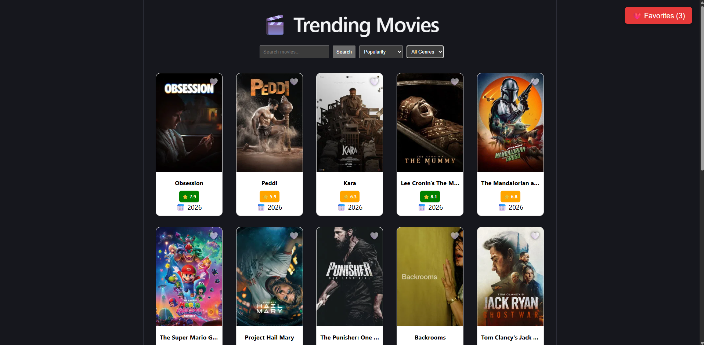

# 🎬 Movie Explorer App

A React-based movie browsing application that uses the TMDB API to search, discover, and explore movies. Users can view details, watch trailers, and save favorites.

---

## 🚀 Features

- 🔍 Search movies by title
- 🎭 Filter by genre
- 📊 Sort by popularity, rating, release date, or title
- ❤️ Add/remove favorite movies (stored in context)
- 🎬 Movie details page with:
  - Trailer (YouTube embed)
  - Full movie overview
  - Runtime, rating, release date
  - Cast list
  - Similar movies
- 📄 Pagination support
- ⏳ Loading skeletons for better UX
- 🎨 Responsive grid layout

---

## 🛠️ Tech Stack

- React (Vite)
- React Router DOM
- Context API
- TMDB API
- CSS (vanilla)

## 📁 Project Structure

```bash
src/
├── components/
│   ├── MovieCard.jsx
│   ├── MovieCard.css
│   ├── SkeletonCard.jsx
│   ├── SkeletonCard.css
│
├── context/
│   ├── FavoritesContext.jsx
│
├── pages/
│   ├── Home.jsx
│   ├── Home.css
│   ├── MovieDetails.jsx
│   ├── MovieDetails.css
│   ├── Favorites.jsx
│   ├── Favorites.css
│
├── services/
│   ├── tmdb.js
│   ├── favorites.js
│
├── App.jsx
├── App.css
└── main.jsx
```

## ⚙️ Setup & Installation

1. Clone the repo

   ```bash
   git clone https://github.com/samogdovin193-dotcom/Movie-app.git
   cd Movie-app
   ```

2. Install dependencies

   ```bash
   npm install
   ```

3. Add TMDB API key

   VITE_TMDB_API_KEY=your_api_key_here

4. Run the app

   ```bash
   npm run dev
   ```

## 🔑 API Used

This project uses The Movie Database (TMDB):

https://www.themoviedb.org/

You need an API key to fetch movie data.

## 🔐 Environment Variables

Create a `.env` file in the root:

VITE_TMDB_API_KEY=your_api_key_here

⚠️ Important:

- Must start with VITE\_
- Restart dev server after changes

## ❤️ Favorites System

Favorites are managed using React Context and stored locally in memory (can be extended to localStorage).

## 🎯 Future Improvements

- 🔐 Authentication system
- 💾 Save favorites to backend or localStorage
- 🎥 Advanced filtering (year, language, etc.)
- 📱 Mobile UI improvements
- ⚡ Performance optimization (lazy loading images)

## 📸 Preview



## 🌍 Live Demo

👉 [Movie App](https://movie-app-coral-delta.vercel.app/)

## 👨‍💻 Author

Built by Ing. Samuel Gdovin.
A frontend developer focused on learning React through real-world projects.

## 📄 License

This project is for educational purposes.
